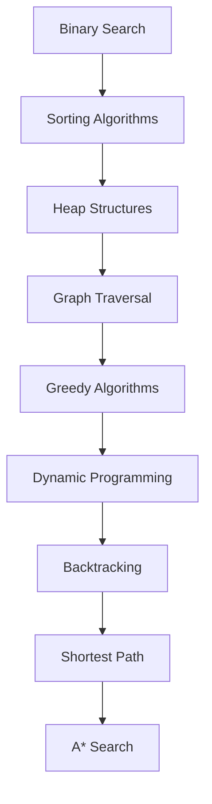

# 🚀 Design & Analysis of Algorithms Lab

<div align="center">

# ⚡ DAA LAB COLLECTION ⚡

### A Complete Implementation of Classical Algorithms in C


*"From Binary Search to A* Search — a journey through the foundations of Computer Science."*

</div>

---

## 🎯 About

This repository contains a curated collection of **24 fundamental algorithms and data structure implementations** developed as part of the **Design and Analysis of Algorithms Laboratory**.

Each module includes:

- 📄 C Source Code
- 🧠 Algorithm / Pseudocode
- ⚙️ Efficient Implementation
- 📚 Educational Reference

Whether you're preparing for:

- 🎓 University Lab Exams
- 💻 Technical Interviews
- 🏆 Competitive Programming
- 📖 Algorithm Fundamentals

this repository serves as a complete learning resource.

---

# 🗂️ Repository Structure

```text
DAA-LAB
│
├── 1_Binary_Search
├── 2_Max_Min
├── 3_Merge_Sort
├── 4_Quick_Sort
├── 5_Randomized_Quick_Sort
├── 6_BFS
├── 7_DFS
├── 8_Topological_Sorting
├── 9_Heap_Sort
├── 10_Priority_Queue_using_Heap
├── 11_Disjoint_Set_Manipulation
├── 12_Fractional_Knapsack
├── 13_Job_Sequencing_with_Deadlines
├── 14_Kruskal_Algorithm
├── 15_Prim_Algorithm
├── 16_Dijkstra_Algorithm
├── 17_01_Knapsack
├── 18_Matrix_Chain_Multiplication
├── 19_Bellman_Ford
├── 20_Floyd_Warshall
├── 21_N_Queens
├── 22_Graph_Colouring
├── 23_Hamiltonian_Cycle
└── 24_15_Puzzle_Problem
```

---

# ⚔️ Algorithm Arsenal

## 🔍 Searching & Sorting

| No. | Algorithm | Technique | Complexity |
|------|------------|------------|------------|
| 1 | Binary Search | Divide & Conquer | O(log n) |
| 2 | Max-Min | Divide & Conquer | O(n) |
| 3 | Merge Sort | Divide & Conquer | O(n log n) |
| 4 | Quick Sort | Divide & Conquer | O(n log n) Avg |
| 5 | Randomized Quick Sort | Randomized | O(n log n) Avg |
| 9 | Heap Sort | Heap Based | O(n log n) |

---

## 🌐 Graph Algorithms

| No. | Algorithm | Purpose |
|------|-----------|---------|
| 6 | BFS | Graph Traversal |
| 7 | DFS | Graph Traversal |
| 8 | Topological Sorting | DAG Ordering |
| 14 | Kruskal's Algorithm | MST |
| 15 | Prim's Algorithm | MST |
| 16 | Dijkstra's Algorithm | Shortest Path |
| 19 | Bellman-Ford Algorithm | Negative Edge Handling |
| 20 | Floyd-Warshall Algorithm | All Pairs Shortest Path |
| 22 | Graph Colouring | Constraint Satisfaction |
| 23 | Hamiltonian Cycle | Backtracking |

---

## 🧩 Greedy, DP & Backtracking

| No. | Algorithm | Paradigm |
|------|-----------|-----------|
| 10 | Priority Queue using Heap | Heap |
| 11 | Disjoint Set Manipulation | Union-Find |
| 12 | Fractional Knapsack | Greedy |
| 13 | Job Sequencing with Deadlines | Greedy |
| 17 | 0/1 Knapsack | Dynamic Programming |
| 18 | Matrix Chain Multiplication | Dynamic Programming |
| 21 | N Queens | Backtracking |
| 24 | 15 Puzzle Problem | A* Search |

---

# 🧠 Concepts Covered

<div align="center">

| Topic | Status |
|--------|--------|
| Divide & Conquer | ✅ |
| Greedy Algorithms | ✅ |
| Dynamic Programming | ✅ |
| Graph Theory | ✅ |
| Backtracking | ✅ |
| Heuristic Search | ✅ |
| Shortest Path Algorithms | ✅ |
| Minimum Spanning Trees | ✅ |
| Data Structures | ✅ |

</div>

---

# 📈 Learning Progression



---

# 🚀 Compilation & Execution

### Compile

```bash
gcc program.c -o output
```

### Run

```bash
./output
```

---

# 📚 Complete Algorithm Checklist

```text
✓ Binary Search
✓ Max-Min Problem
✓ Merge Sort
✓ Quick Sort
✓ Randomized Quick Sort
✓ Heap Sort
✓ BFS
✓ DFS
✓ Topological Sorting
✓ Priority Queue using Heap
✓ Disjoint Set Manipulation
✓ Fractional Knapsack
✓ Job Sequencing with Deadlines
✓ Kruskal's Algorithm
✓ Prim's Algorithm
✓ Dijkstra's Algorithm
✓ 0/1 Knapsack
✓ Matrix Chain Multiplication
✓ Bellman-Ford Algorithm
✓ Floyd-Warshall Algorithm
✓ N Queens Problem
✓ Graph Colouring
✓ Hamiltonian Cycle
✓ 15 Puzzle Problem (A*)
```

---

## 🏆 Algorithm Categories

```text
Searching         ████░░░░░░
Sorting           ████████░░
Greedy            ██████░░░░
Graph Theory      ██████████
Dynamic Prog.     ██████░░░░
Backtracking      ███████░░░
Heuristic Search  ███░░░░░░░
```

---

<div align="center">

# ⭐ Star This Repository

### If this repository helped you in your DAA journey,
### consider giving it a ⭐ on GitHub.

---

### 💡 "An algorithm must be seen to be believed."

— Donald Knuth

</div>